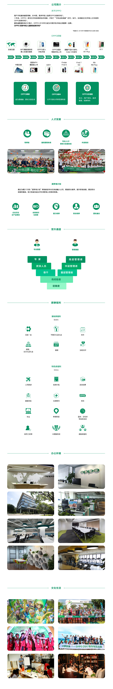

# 内推方式    

社招为主，地域不限(全国和海外有办公地点即可)
请将简历发送至 2466104916@qq.com  (我的oppo邮箱没有外部发送的权限)
简历或邮件文本中附上你的姓名、邮箱、手机号、意向城市    
简历标题：oppo内推-姓名-开发方向-**意向城市**，如 oppo内推-张三-android开发-**深圳**    
    

# 面试流程    

1. 通常三面,中间可能会隔几天.
   - 两个高级工程师一面；
   - 主管或部长二面
   - hr三面    
2. 面试可能是现场 ,电话面,也可能是在线面,根据你的情况来协调；    
3. 一天只会面试一轮,面完会通知面试结果。    

# 岗位介绍    

**社招官网**   [https://sc.hotjob.cn/wt/OPPO/web/index/social  
官网的岗位如果有特别感兴趣的，可以在内推邮件中说明。    

- 走内推,可以跟踪进度
- 会优先查看简历 ,获得面试机会
- 我可以给你一些小建议 

# 复习指南    

-  认真查看招聘要求,按照上面的要求准备
- 对自己的项目要滚瓜烂熟,回答问题避免支支吾吾
- 要有编码思维,回答问题尽可能考虑全面
- **态度谦虚,    不卑不亢,敢要钱**

# 公司简介    

- 五险一金,加班零食,办公环境,打车...这种普惠福利没什么好说的,我谈谈自己的看法

- 富有竞争力的薪酬福利,组里的同事在来oppo几年后,都在深圳买了房

- 有固定年终和浮动年终两种模式,公司没上市,可以买内部股票

- 完善的任职资格制度,薪资根据任职资格定

- 内部有很多鼓励创新的奖项,只要你有想法,就会有收获

  

# Q&A    

- 欢迎大家找我内推
- 能与各位优秀的大佬共事