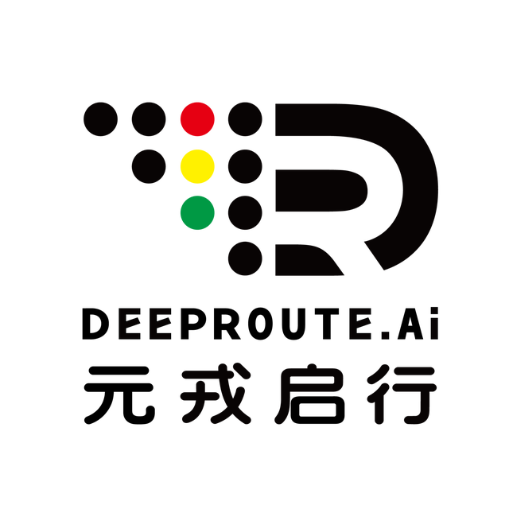

## 元戎启行
元戎启行是一家有着国际化背景专注于L4级的自动驾驶公司。在深圳、北京、硅谷均设有研发中心，核心技术团队汇集了清华、北大、剑桥、哥伦比亚、卡耐基梅隆等国内外名校的硕博士。以及来自谷歌、微软、福特、Intel、通用、Cruise、百度、华为、腾讯等世界顶尖科技公司的研发人员。公司的技术人员覆盖感知、高精度地图及定位、规划控制、硬件系统、基础架构，仿真建模，云计算和存储等自动驾驶全研发链。

元戎启行目前在深圳、武汉等多地已经完成夜晚、隧道等复杂场景的路测，并展开了自动驾驶车队运营、全栈解决方案提供等方面的合作。

### 内推方式
任何问题可以在公众号“内推才有喵罐头”咨询！

每天查看消息及邮箱，若没及时回复还请谅解~

邮箱：yujiezhao@deeproute.ai

邮箱标题格式：姓名+应聘岗位+任一你认为能够胜任这份工作的特点或能力（如x年相关工作经验/某某大学/参加过哪些比赛等）招聘对象：2021年海内外应届毕业生
 （本硕博皆可）

### 内推岗位
关注公众号“内推才有喵罐头”查看详细岗位信息！

Ps. 牛客搜索 f_zyj 同样可以找到相关内推信息！
