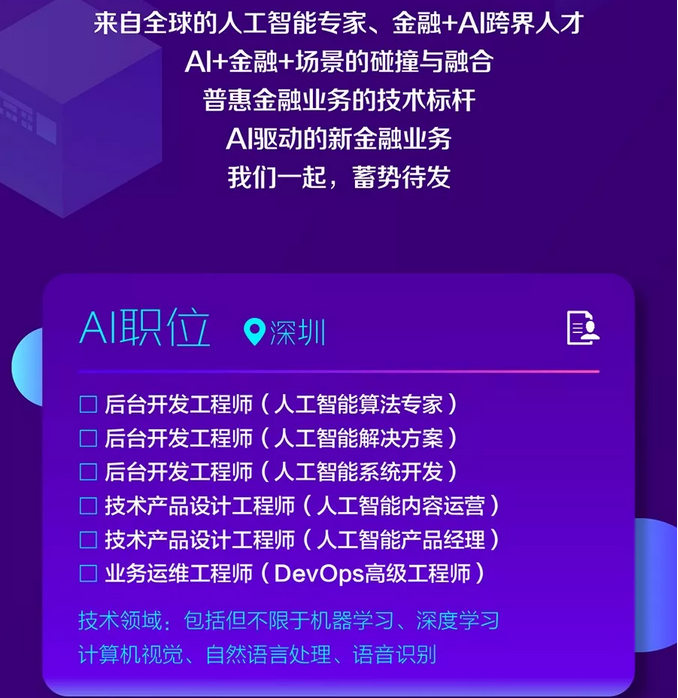

# 内推方式

微众银行目前只内推社招
找HR实习

招运维工程师 组内直推
业务运维工程师
工作内容
1、 负责业务系统的日常运维、突发异常的应急响应和处理工作；
2、 负责业务系统的运行状况和性能监控，及时发现隐患和容量瓶颈并推动优化，提高业务系统的健壮性和服务时效；
3、 参与业务系统架构的可运维性设计，推动业务系统按照运维规范开发投产；
4、 参与运维工具开发维护和运维自动化体系建设。

职位要求
1、 本科及以上学历，计算机或相关专业；
2、 3年及以上业务系统运维经验，有大型互联网公司运维经验优先。
3、 精通Linux系统运维，对Linux操作系统原理有一定的理解;
4、 熟悉TCP/IP协议，能够进行网络抓包分析;
5、 熟练掌握Shell、Python、Perl、Java语言，并能使用其中一两门语言进行编码;
6、 责任心强，具备良好团队合作精神，较强的安全风险意识。

工作地点
深圳市南山区沙河西路1819号深圳湾科技生态园7栋A座
# 面试流程

- 一轮技术面
- 二轮技术面
- 三部门长面
- HR 面

# 岗位介绍

可以直接到官网看，然后简历发我，标注是内推，校招还是社招。tip:附带另外给姓名，手机，邮箱。

邮箱：alexcai@webank.com

网址：https://webank.cheng95.com/positions/search。

# 复习指南

# 公司简介

微众银行是国内首家开业的民营银行，由腾讯、百业源和立业等多家知名企业发起设立

于2014年12月获得由深圳银监局颁发的金融许可证

微众银行严格遵守国家金融法律法规和监管政策，以合规经营和稳健发展为基础

致力于为普罗大众、微小企业提供差异化、有特色、优质便捷的金融服务

https://www.webank.com/

# Q&A

